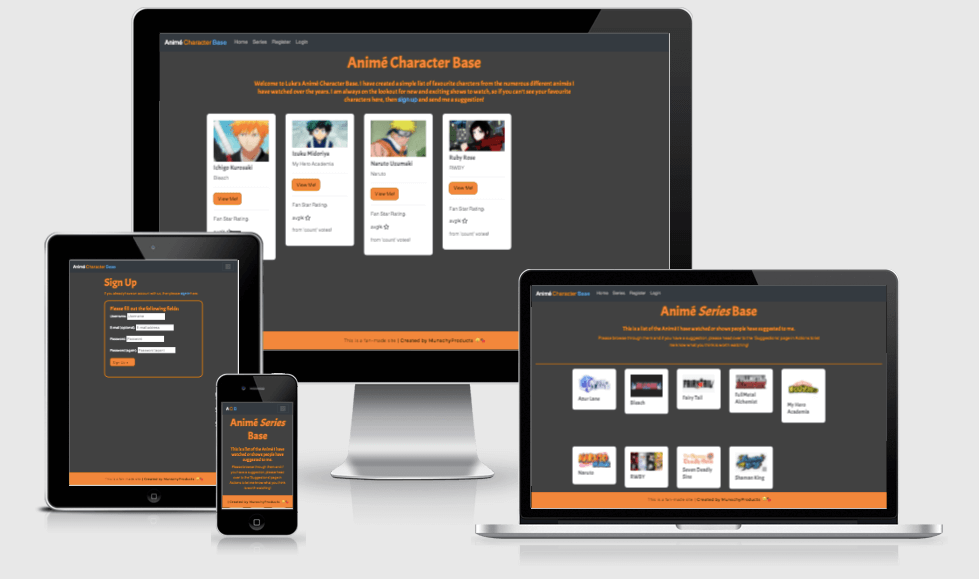

# Luke's Animé Character Base

## # Table of contents:

1. [Link To Live Site](#linktolivesite)
2. [LucidChart ERD Diagram](#lucidcharterddiagram)
3. [Wireframes](#wireframes)
3. [Overview](#overview)
4. [User Stories](#userstories)
6. [Features](#features)
    1. [Index Page](#indexpage)
    2. [Character View Page](#characterviewpage)
    3. [View/Add Series List Page](#serieslist)
    4. [Suggestions Page](#suggestionspage)
    5. [Sign In/Out/Up Pages](#signin/out/uppages)
    6. [Create/edit Character Page](#createcharacterpage)
7. [Features to Implement](#featurestoimplement)
8. [Testing](#testing)
    1. [Lighthouse Reports](#lighthousereports)    
9. [Unfixed Bugs](#unfixedbugs)
10. [Deployment](#deployment)
    1. [Forking and Cloning](#forkingandcloning)
    2. [Local Deployment](#localdeployment)
    3. [Remote Deployment](#remotedeployment)
11. [Credits](#credits)

## Link to live site

https://lukeanimebase.herokuapp.com/

## LucidChart ERD Diagram

[Luke's Animé Base ERD Diagram](static/images/lukeanimebaseERD.png)

## Wireframes

To bring my idea to life, I have knocked up some wireframes to help me make my app and how to structure the content. I have made these for each relevant page (some I have grouped as content and forms are going to look so similar):

[Index page](static/images/index.png)

[Character Detail](static/images/character_detail.png)

[Series List](static/images/series_list.png)

[Suggestions](static/images/suggestions_wireframe.png)

[Create/Edit Character/Series/Suggestion](static/images/add_edit_char_series_sug.png)

[Sign In/Up](static/images/sign_in_up.png)

[Sign Out](static/images/sign_out.png)

## Overview

Luke's Animé Character Base is a site that will allow the Owner of the site to manage their favorite characters from their favorite animé shows.

The owner of the site can create a series and then list their favorite characters. Users will then be able to rate their favorite characters and leave comments on them for the Owner to review.

If a character that the users like doesn't appear on the site, then they can send a suggestion to the Owner and other people can see the suggestions too.

## User Stories

When people visit my site, I want them to be able to engage with the content; View their favorite characters, rate them, see the list of series that the admin has viewed and added as well as see and leave suggestions for the admin to review and implement at their leisure.

On all future visits, I would like them to see how the characters have been 'treated' by other users; new comments and engage with other users, add new suggestions if one comes to mind.

For my site to maximize the engagement, this is the list of user stories to address my problem statement - "How do I create a site that allows the maximum engagement from users to interact with my content"

[[#1](https://github.com/lukemunsch/anime-character-base/issues/1)] - Display Characters on the main index page for users

[[#2](https://github.com/lukemunsch/anime-character-base/issues/2)] - Add Character to keep content updated and fresh

[[#3](https://github.com/lukemunsch/anime-character-base/issues/3)] - Edit Character to make sure info is correct or update different pictures

[[#4](https://github.com/lukemunsch/anime-character-base/issues/4)] - Delete Character if no longer require or no one comments

[[#5](https://github.com/lukemunsch/anime-character-base/issues/5)] - Rate Character - This was not completed but would involve user input to show the most popular characters

[[#6](https://github.com/lukemunsch/anime-character-base/issues/6)] - Comment on Characters so that people can leave their feedback

[[#7](https://github.com/lukemunsch/anime-character-base/issues/7)] - Sign Up/In/Out for users to receive full activities on the site

[[#8](https://github.com/lukemunsch/anime-character-base/issues/8)] - Create Series based on viewing or recommendation

[[#9](https://github.com/lukemunsch/anime-character-base/issues/9)] - Edit Series to keep content up to date and fresh

[[#10](https://github.com/lukemunsch/anime-character-base/issues/10)] - Delete Series if no longer require

[[#11](https://github.com/lukemunsch/anime-character-base/issues/11)] - Display Suggestions that users have left me to watch or add

[[#12](https://github.com/lukemunsch/anime-character-base/issues/12)] - Create suggestions for the admin to review

[[#13](https://github.com/lukemunsch/anime-character-base/issues/13)] - Delete Comments that are inappropriate or not necessary

## Features

For my Animé Character Base, I have chosen a very simple color scheme that is consistent throughout my site;

- I chose dark base colors for the main content to be displayed on.
- Recurring themes in some animé is the color orange (Naruto's suit and Ichigo's hair etc) which will be the predominant color for text and icons.
- I thought card style for the displaying of characters with simple functions through the use of buttons for each character or series. I went with the nice white background to help it stand out against the darker background.
- My list of suggestions is a simple collapsible list so that people can see what is suggested, but open up the suggestions to find out why people are suggesting them.
- My Main nav bar is responsive to the size of the screen and allows for a drop-down in case of smaller screen sizes. It is also adaptable depending on if you are logged in (able to see suggestions and leave comments) or are a superuser (capable of adding character and series and deleting items). The darker color scheme is to separate it from the main body of the site whilst still leaving the contract between elements clear.
- My footer is consistent across all pages as well; orange banner with a couple of pieces of writing. The amount of writing is different depending on the size of the screen as we don't want to bar to suddenly increase in height and obstruct any of the other elements for nav or viewing/editing/deleting.

These are the pages that I have set up to make the site as functional as the Owner may need. This is what I have made: -

### Index

[Index page](static/images/screenshots/index-ss.png)

[Nav bar](static/images/screenshots/nav-ss.png)

### Displaying Characters

[Character Detail page](static/images/screenshots/char-det-ss.png)

[Character details page pt.2](static/images/screenshots/char-det2-ss.png)

### Create/Edit Characters/Series/Suggestions

[Item creation page](static/images/screenshots/create-page-ss.png)

### Views Series List Page

[Series List](static/images/screenshots/series-ss.png)

### Suggestion Page

[Suggestions page](static/images/screenshots/suggest-ss.png)

### Sign In/Out/Up Pages

[Log in/out/up style](static/images/screenshots/logout-ss.png)

## Features to Implement

One thing that I looked into was the Rating system and implementing a way for users to vote for their favorite characters. I came across many different issues that prevented me from making it work and with the limited time, I decided to remove my attempt and leave it out of my final deployment.

## Testing

### Lighthouse Reports

Here are the lighthouse reports for validation that Luke's Animé Base is suitable:

[Create character page](static/images/lighthouse-reps/add-character-lighthouse.png)

[Character details](static/images/lighthouse-reps/char-details-lighthouse.png)

[Deleting objects page](static/images/lighthouse-reps/delete-lighthouse.png)

[Index page](static/images/lighthouse-reps/index-lighthouse.png)

[Series list page](static/images/lighthouse-reps/series-list-lighthouse.png)

[Signout page](static/images/lighthouse-reps/signout-lighthouse.png)

[Signup/in page](static/images/lighthouse-reps/signup-in-lighthouse.png)

[Suggestions page](static/images/lighthouse-reps/suggestions-lighthouse.png)

### HTML Testing

After running tests on the documents in the W3C validator, these are the confirmation images of the completed reports

[Index page](https://validator.w3.org/nu/?doc=https://lukeanimebase.herokuapp.com/)

[Series list](https://validator.w3.org/nu/?doc=https://lukeanimebase.herokuapp.com/series_list/)

[Suggestions page](https://validator.w3.org/nu/?doc=https%3A%2F%2Flukeanimebase.herokuapp.com%2Fsuggestions%2F)

[Account register](https://validator.w3.org/nu/?doc=https://lukeanimebase.herokuapp.com/accounts/signup/)

[Account login](https://validator.w3.org/nu/?doc=https://lukeanimebase.herokuapp.com/accounts/login/)

[Account logout](https://validator.w3.org/nu/?doc=https%3A%2F%2Flukeanimebase.herokuapp.com%2Faccounts%2Flogout%2F)

[Example of character viewing page](https://validator.w3.org/nu/?doc=https://lukeanimebase.herokuapp.com/naruto-naruto-uzumaki/)

[Delete page](https://validator.w3.org/nu/?doc=https%3A%2F%2Flukeanimebase.herokuapp.com%2Fdelete_char%2Fazur-lane-test-pag)

[Create page](https://validator.w3.org/nu/?doc=https%3A%2F%2Flukeanimebase.herokuapp.com%2Fcreate_character%2F)

### CSS testing

This is the completed test for my CSS file:

[CSS Validator](static/images/validators/css-validator.png)

### Python Tests

I have run my site through the PEP8 validators and report no issues regarding Luke's Anime Base.

### Site Tests

#### Manual Test

I have run this project on numerous different devices and involved outside users to create their own logins and comments; all functionality worked correctly and no errors were discovered on deployed site. As an admin I was successful in creating characters, deleting characters, and editing them to keep them updated.

#### Automatic Tests

I had a lot of problems with my testing; the testing I completed covers 89% of my project, but my views struggled to get up to completion. I have included the report for the testing that I have done which shows my automatic tests.

[Coverage Report](static/images/validators/test-coverage.png)

## Unfixed Bugs

There is currently an issue with the styling of the images that appear on the character detail page where the file doesn't quite sit in the correct place and is not responsive; If I remove the size limit then the image sits behind the text on the right instead of fitting itself to the container. This was addressed by myself and tutors but was unable to fix the issue.

If an Admin user attempts to create an object that is the same as something that already exists, the new object doesn't appear, but no warning comes up; we do get the confirmation that the series was created, but that is not what we want.

Another issue is the responsive nature of divisibleby:number; My page doesn't always have the perfect alignment for its displayed items, which means sometimes the rows are not quite filled all the way. This is something that I would look into if I were to develop this app further.

## Deployment

To deploy the project, allow other people to run the app and see it working, there are 3 methods to allow you to complete these actions:

### Forking and Cloning

Accessing GitHub and navigating to my repositories will allow users to copy my code directly from the source, either by forking or cloning: Accessing the animé character base repository and clicking on the code button next to Gitpod link will bring up a drop-down to create a repository of your own in your own GitHub repo. You can also download a zip file and copy the information into a new file of your own making to continue working on it.

### Local Deployment

For my local deployment, I use Gitpod to edit and run my terminal;
- From GitHub, once the repository has been created (either as a new project or by forking/cloning) I will then click on the Gitpod button to implement the creation of a workspace to edit the promotional sales review system.

***The workspace should not be closed due to the env.py file - as it is never added to GitHub, if you create a new workspace you will need to re-add the env.py file and reinstall all libraries used each time. Pinning a workspace and accessing it from Gitpod workspaces rather than GitHub button would prevent this loss of information each time***

### Remote Deployment

For this project, remote deployment is a complex procedure and I will list out the complete steps to make your site work on a separate hosting service; For my project, I will be using Heroku.

- This first step, once we are in Gitpod, is to install our required packages and libraries:
    - Using Command Line Interface (CLI) in the terminal, type:

            pip3 install Django==3.2 gunicorn
            pip3 install dj_database_url psycopg2
            pip3 install dj3-cloudinary_storage

    - we need to add these to our requirements.txt file using the CLI:

            pip3 freeze --local > requirements.txt

- We now need to build our Project structure using the CLI:

        django-admin startproject PROJ_NAME .
***The trailing full stop is very important so please don't forget to include it in your command***
    - For my project, I named it lukeanimebase, but you can choose anything.

- Once we have the project, we need to create an actual app to handle our individual functions:
    
        python3 manage.py startapp APP_NAME

    - My app is called collection as it is designed to handle my collection of characters, comments, series, and suggestions.

- Now we have an app, we need to add it t our approved INSTALLED_APPS in the Project settings.py file

- Once they are linked, we have to migrate changes to our database - by creating the app we have created a models.py file that handles our database designs and these have to be migrated over to the database to function. To do this, in the CLI terminal, type:

        python3 manage.py migrate

- To test if this is correctly built, in CLI, type:

        python3 manage.py runserver

This has built the foundation for our project, now we need to get the Heroku App built to receive the information from Github.

- In Heroku.com create/sign in to account and then navigate to the dashboard and create a new app with an appropriate APP_NAME and set the region to whichever is most appropriate - for myself it was Europe.
- We need to add a database to the app to store our uploaded record entries: For this, we need to go to the Resources tab and run a search for the Add-on called 'Heroku Postgres'
- in the Settings tab, we can now click Reveal Config Vars and we have a new KEY/VALUE pair for our DATABASE_URL with a Postgres:// address. Copy the Value in its entirety.

We will now be swapping between our Dev Environment as well as Heroku to complete deployment.

- In our Dev Environment, we need to create a new env.py file to handle all the values that we need to keep secret. This must be at the top level of our file structure. We need to import a library and define some details into this file:

        import os

        os.environ["DATABASE_URL"] = "paste postgres:// here"

        os.environ["SERCRET_KEY"] = "input a secret key"

***There are secret key generators online to help you generate one, or you can simply put a random string of letters together***

- Take the secret key value and head to the Heroku dashboard to reveal config vars again.
    - This time add a new key called SECRET_KEY
    - Paste in the value you copied from the env.py file

- In our settings.py file, we now need to make sure our project references the new variables from the env.py file, so we need to add below the current imports Path line:

        import os
        import dj_database_url

        if os.path.isfile("env.py"):
           import env

- There is already a secret_key variable, but we need to replace the existing value with os.environ.get("SECRET_KEY")
- We have a databases variable already assigned as well, but we are going to comment out this existing section and replace it with our own:

        DATABASES_URL = {
            'default': dj_database_url.parse(os.environ.get("DATABASE_URL"))
        }

- Now we have linked up a new Database, we need to migrate our files again to make sure they are linked - In CLI type:

        python3 manage.py migrate

Along with our DevEnv and Heroku, we also need one additional facility to handle our static and media files: Cloudinary

- In a browser, navigate to Cloudinary.com and sign in/up for an account.
- Once in, you will have, on your dashboard, a set of information for linking your DevEnv and Heroku to it.
    - Copy the CLOUDINARY_URL (also known as the API Environment Variable) value and head over to the env.py file:

            os.environ["CLOUDINARY_URL"] = "cloudinary:// pasted here"

    - Back in Heroku, settings, reveal config vars, add new Key/Value pair called CLOUDINARY_URL with the "Cloudinary:// value"
    - The last thing we need to add to our Heroku, for now, is the DISABLE_COLLECTSTATIC Key with the value set to 1.

- In our INSTALLED_APPS in the setting.py file, we must now add a couple of new lines:

        'cloudinary_storage',    //this must go above staticfiles
        'django.contrib.staticfiles',    //this already exists
        'cloudinary',    //this must go below the staticfiles

***The order of these lines is very important so make sure they are in the correct order!!!***

- For our app to use the correct storage location, we need to tell our settings.py file the correct Cloudinary information. Below the STATIC_URL = "/static/", add:

        STATICFILES_STORAGE = 'cloudinary_storage.storage.StaticHashedCloudinaryStorage'
        STATICFILES_DIRS = [os.path.join(BASE_DIR, 'static')]
        STATIC_ROOT = os.path.join(BASE_DIR, 'staticfiles')

        MEDIA_URL = '/media/'
        DEFAULT_FILE_STORAGE = 'cloudinary_storage.storage.MediaCloudinaryStorage'

- We now need to link the file to the templates directory in Heroku. Under the BASE_DIR line, add:

        TEMPLATES_DIR = os.path.join(BASE_DIR, 'templates')

- We need to tell the templates directory where we will find the templates we will be using, so in TEMPLATES, in the 'DIRS' variable list, we need to add 

        'DIRS': [TEMPLATES_DIR],

- The last thing in our settings.py file we need to include, is the host locations for running our app. We need one for Heroku and one for our local DevEnv, so we just need to adjust the following:

        ALLOWED_HOSTS = ["PROJ_NAME.herokuapp.com", "localhost"]

- So now we have storage for our files, we need to add our folders to the correct locations - in our top level of the directory, we now need to add media, static, and templates.

- We need to create a file that tells Heroku exactly how we expect the app to be run, so we need to create the Procfile (The initial cap is intentional) in the top level of the directory.
- In Procfile, we need to add:

        web: gunicorn PROJ_NAME.wsgi

- We now need to save the files and structure we have created in gitpod to our GitHub repository using the CLI:

        git add .
        git commit -m "deployment commit"
        git push

- Once this has been pushed to our main branch, we need to get our main branch deployed to Heroku.

- In Heroku, Deploy tab, we can add our Github repository to the deployment method. Once this is linked, we can scroll down and deploy the main branch.

At this point, the same screen from our 'runserver' test should now be displayed on the deployed webpage. This is the basic deployment of the app completed.

For final deployment:

- Change DEBUG to False in our settings.py file

- Add X_FRAME_OPTIONS = 'SAMEORIGIN'

This completes the settings part of Luke's Animé Base, but we still need to upload the final settings with:

        git add .
        git commit -m "deployment commit"
        git push

This should now have the final design of your site all working perfectly. You have successfully deployed the site!

***JUST TO REITERATE - For final deployment of site, remember to switch debug to False as this will allow anyone to gain access to secret information***

## Credits

I would like to thank the dedicated team of tutors at Code Institute for helping me to overcome certain issues with the project regarding several different problems that arose.

My mentor Chris Quinn was amazing at helping me to understand the project and guide me to create the best possible project.

The Slack community helped me with user stories and quick fixes that allowed me to progress with my project when I became stumped.

A huge thank you to Scott and John from the tutors as they were regular helpers on this project and fixed an issue regarding my static files.